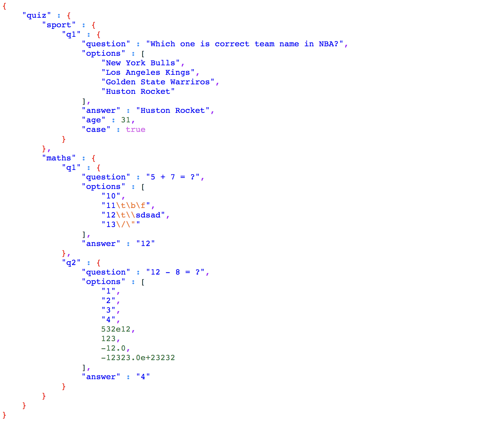

# Json to HTML convertor

### Build Guide
```bash
cabal exec -- ghc --make scanner.hs
./scanner input.json output.html
```

### Result
Origin Json File
```json
{
    "quiz": {
        "sport": {
            "q1": {
                "question": "Which one is correct team name in NBA?",
                "options": [
                    "New York Bulls",
                    "Los Angeles Kings",
                    ...
                ],
                "answer": "Huston Rocket",
                "age": 31,
                "case": true
            }
        },
        ...
    }
}
```
HTML opened in browser


### What I Learned during this project...

#### Syntax
- [About $ and .](https://stackoverflow.com/questions/940382/what-is-the-difference-between-dot-and-dollar-sign)

- [Maybe and Just](https://stackoverflow.com/questions/18808258/what-does-the-just-syntax-mean-in-haskell)

- IO _
    when return type is IO _, use <- to assign it to a variable
    ```haskell
    addOne :: Int -> IO Int
    addOne x = do
        return x 

    main = do
        value <- addOne 1
        print(value)
    ```
- unusual **show**
    ```haskell
    > show '"'
    "'\"'" :: String
    > show '\\'
    "\\\\" :: String
    > show 'x'
    "'x'" :: String
    ```
    if want to convert Char to String
    ```haskell
    > ['x']
    "x" :: [Char]
    ```

#### Regular Expression with PCRE
[regex cheat sheet](https://cheatsheet.codeslower.com/CheatSheet.pdf)
**Install**
```bash
$ cabal install regex-pcre
```
**Error may occur**
```bash
Wrap.hsc:148:10: fatal error: 'pcre.h' file not found
#include <pcre.h>
```
**solution for mac**
```
brew install pcre
cabal install regex-pcre
```
#### cabal
Manage packages in local directroy
```bash
cabal sandbox init
```
to use ghci with packages with local sandboxs
```bash
# For GHC < 7.6
$ ghci -no-user-package-conf -package-conf .cabal-sandbox/x86_64-osx-ghc-8.2.2-packages.conf.d
```
to comile hs file with local sandboxs
```bash
cabal exec -- ghc --make myhaskell.hs
```


